# Ecuador: iniciativas futuras
## Propuesta de iniciativas para la Fundación Real Madrid

Nos complace presentar estas ideas que buscan desencadenar un proceso gradual de mejora social en la provincia de Manabí-Ecuador, así como en otras áreas del país que estén alineadas con los más de 150 proyectos de la Fundación Real Madrid (FRM) en Latinoamérica.

  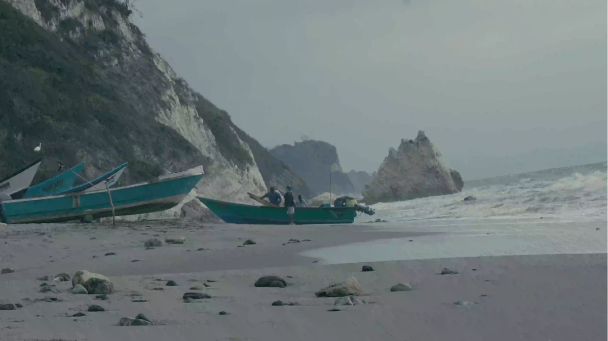
   
  <em>El cantón Jama es uno de los asentamientos más antiguos y representativos de la provincia de Manabí.</em>

---

## Visión general
Nuestro objetivo es fortalecer el trabajo de la FRM para ofrecer herramientas prácticas y concretas a los niños de Manabí y sus familias, las mismas que podrán usarse para empezar a construir un futuro estable y pleno, con esfuerzo, paciencia y perseverancia.

Estas iniciativas están diseñadas para fortalecer la autoestima, la autonomía, el acceso responsable a tecnología, el acceso a educación en valores, el acceso a salud y el acceso a alimentación. Además, todas nuestras líneas de acción estarán respaldadas por campañas potentes de educación civil (casi inexistentes en Ecuador), diseñadas para fortalecer el tejido social y garantizar que la transformación en Manabí sea profunda y sostenible en el tiempo.

---

## Propuesta 1. Mentoría tecnológica

### El desafío: falta de motivación
Los niños de Manabí, en su gran mayoría, tienen intereses y aficiones, mas no metas. Sin metas, la vida se vuelve un transcurrir sin sentido. 

Durante la realización del video “Mucho más que fútbol”, nos adentramos en la realidad de un grupo de niños y familias de la zona de Jama (por logística, una zona más accesible que la de Montecristi, en donde funciona la escuela CAF Núñez). Kod Kod tiene una base en ese sector, concretamente en Loma Don Juan, zona a la que nuestro equipo viaja frecuentemente por descanso, producciones y retiros creativos.

Durante el rodaje antes mencionado, resultó desolador ver de primera mano el futuro con el que sueñan estos niños y niñas: crecer para pasar hambre; criar hijos sin apoyo (en el caso de las niñas) y tratar de olvidar el poco sentido que tiene su vida a través del alcohol (en el caso de los niños), siempre presente durante los fines de semana. Ese es el panorama que para ellos pintan sus padres, desde la inconsciencia y la repetición casi inevitable de patrones tóxicos. 

Pero no solo eso. A la mayoría de los niños de Manabí se les ha arrebatado el derecho a ser niños sin preocuparse de los problemas de los adultos que supuestamente deben cuidarlos. Los niños de Manabí, muchos de ellos, tal como le pasa a un adulto, necesitan tomar café varias veces al día para "soportar el ritmo" de la vida. Erick, uno de los niños, no mayor de diez años de edad, relató con total naturalidad cómo tuvo que ser el partero improvisado de su tía en dos ocasiones. A su tierna edad, literalmente, trajo al mundo a dos de sus primos. 

> "Erick, un niño no mayor de doce años, relató con total naturalidad cómo tuvo que ser el partero improvisado de su tía en dos ocasiones. A su tierna edad, literalmente, trajo al mundo a dos de sus primos."

  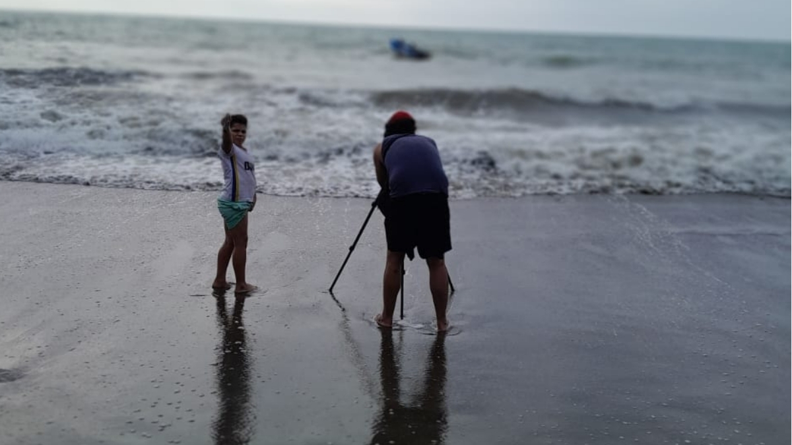
   
  <b>Erick: ejemplo de la resiliencia y madurez prematura.</b>

### La propuesta
Desde Kod Kod, implementaremos un programa piloto de mentoría tecnológica para formar a los estudiantes como creadores de contenido, en alianza con escuelas de cine, periodistas deportivos y realizadores ecuatorianos, dirigido a 15 niños de entre 7 y 15 años. La formación estará orientada hacia el periodismo deportivo en formato vertical, asimilable para los más pequeños, incluyendo conocimientos básicos de teoría del cine.

### Impacto estimado
| Métrica | Detalle |
| :--- | :--- |
| **Expectativa** | El objetivo es que al menos un 80 % de los participantes logren terminar el programa y recibir una certificación. La formación incluye la cobertura de los partidos y torneos de la CAF. |
| **Alcance** | Guayas, Pichincha y Manabí concentran una alta población infantil. Las piezas producidas serán difundidas a audiencias infantiles, aspirando a llegar a 150,000 niños. Como referencia, Pol Deportes ha amasado casi 2 millones de seguidores en TikTok y su hazaña viral le valió narrar un partido del Real Madrid. |

  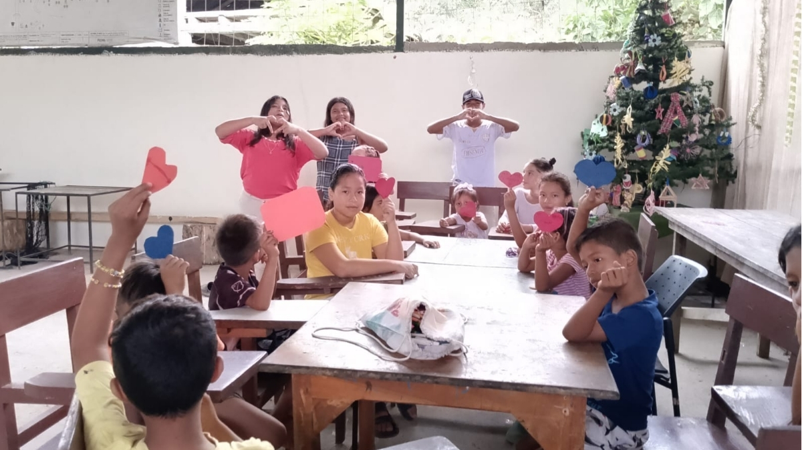

---

  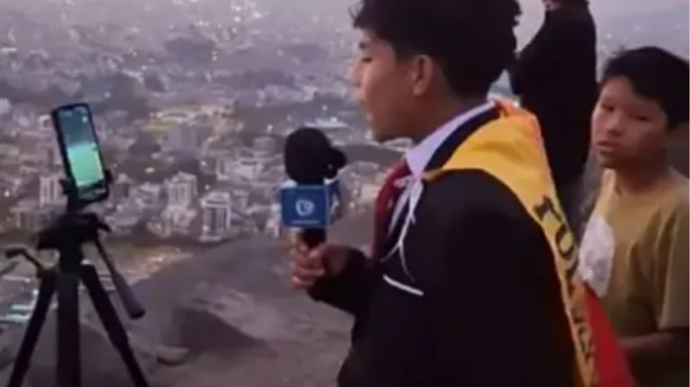
  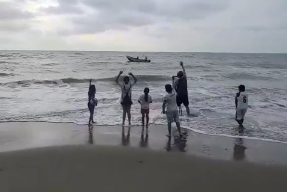

---

## Propuesta 2. Documental vertical “Crónicas de esperanza”

### El desafío: falta de visibilidad
Falta de visibilidad de la gestión de la FRM en Manabí para atraer a más instituciones locales y extranjeras. La provincia está frente a una elección fundamental entre la “luz” (educación y progreso) y la “oscuridad” (pobreza y crimen organizado).

### La propuesta
 La propuesta: serie documental que acompaña a los niños de Manabí beneficiados por la FRM durante una época, para conocer su vida y ver cómo el fútbol y los valores que de él se desprenden van impactando en su vida. El mismo formato puede aplicarse a los logros obtenidos en la Escuela Sociodeportiva, en convenio con la UISEK. 

| Métrica | Detalle |
| :--- | :--- |
| **Expectativa** | Generar un sentido de pertenencia y orgullo local. Buscamos documentar la transición del niño que carece de horizontes hacia un joven con disciplina, gracias al deporte y los valores que la FRM promueve con sus iniciativas. Como señala Yoselin Vélez (Museo Jama Coaque), el habitante local a veces vive con su riqueza cultural, pero *"no le toma mucha importancia"* por la cotidianidad; este documental busca que el niño sea protagonista de su historia. |
| **Alcance** | La serie apunta a audiencias globales interesadas en responsabilidad social. Buscamos atraer la mirada de instituciones internacionales al mostrar que en Manabí existe un potencial humano inmenso que requiere una plataforma de visibilidad. |

  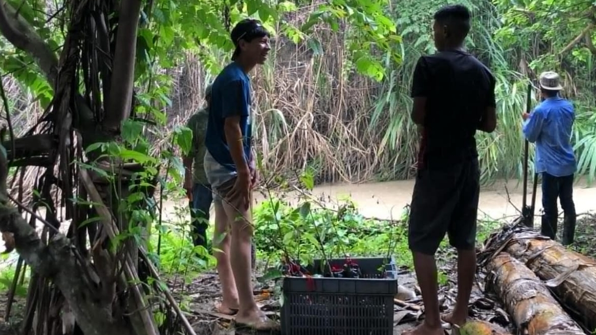
   
  <em>Grupos ciudadanos que hoy operan con recursos limitados pero alto compromiso.</em>

---

## Propuesta 3. La CAF Núñez llega a Jama

### El desafío: expansión territorial
Necesidad de expansión de la escuela CAF Núñez a más zonas de la provincia de Manabí para combatir el abandono estatal.

### La propuesta
Replicar el modelo de la escuela CAF Núñez en la provincia de Jama, concretamente en la zona de Don Juan, que se encuentra a pocos minutos del centro de la ciudad. Es un entorno silencioso y cercano a la naturaleza que permite la conexión con la práctica deportiva. Asimismo, la creación de esta escuela serviría como un motor económico y cultural en una zona azotada por el abandono estatal.

| Métrica | Detalle |
| :--- | :--- |
| **Expectativa** | Formalizar y potenciar iniciativas ciudadanas que hoy operan con recursos limitados, al replicar el modelo de la escuela CAF Núñez en la zona de Jama. Emma Vera, del Municipio de Jama, menciona que existen grupos como los **"Sembradores de paz"**, donde jóvenes que desde el terremoto enseñan a los más pequeños valores a través del juego, pero que *"no tienen para comprar la hoja, para comprar lápiz de colores"* o reponer materiales básicos dañados. La expectativa es profesionalizar estos esfuerzos, enlazándolos con la práctica deportiva y dotándolos de la metodología y recursos de la FRM. |
| **Alcance** | Impactar directamente en las 42 comunidades del cantón Jama. Al establecer una base en Don Juan, se crea un polo de desarrollo donde niños desde los 2 años empiezan a formarse en un ambiente sano y seguro. |

  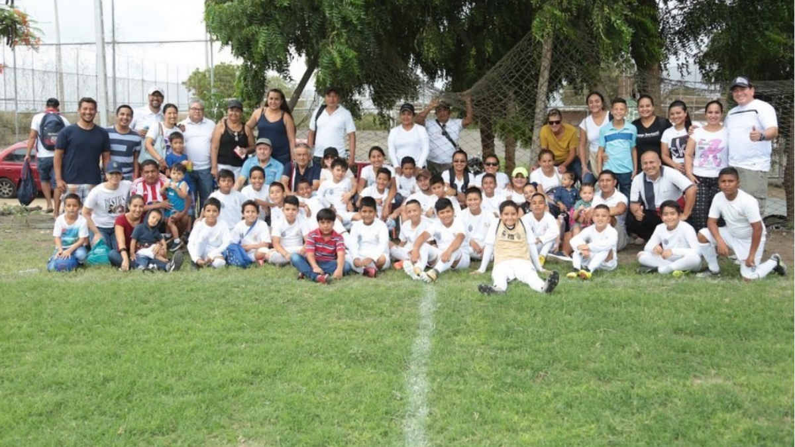

---

## Propuesta 4. Paz, techo y comida

### El desafío: vulnerabilidad sistémica
La vulnerabilidad extrema donde el ingreso familiar a menudo se diluye en el consumo de alcohol, descuidando las necesidades básicas y nutricionales de los menores.

### La propuesta
Desarrollar una iniciativa de largo plazo con aliados como Corporación La Favorita, El Rosado, USFQ y Grupo Futuro para facilitar acceso a salud, educación y alimentación.

| Métrica | Detalle |
| :--- | :--- |
| **Expectativa** | Implementar un sistema de apoyo integral. Emma Vera menciona el modelo actual de entrega de *"funditas de comida"* y charlas médicas. Buscamos mejorar esto introduciendo al deporte como motor: quienes más se involucren recibirán bonos de salud y alimentación, asegurando que el recurso llegue directamente al bienestar del niño. |
| **Alcance** | Lograr una transformación en los hábitos de las familias. Actualmente, se potencia la creación de "huertos orgánicos" y entrega de semillas. Se busca que las madres puedan *"sembrar en su casa y tener para aliñar su comida"* de manera sana y autosustentable. Al introducir el elemento deportivo como motor de desarrollo, es posible potenciar iniciativas de pequeña escala y convertirlas en un sistema sólido de salud alimentaria y evolución social. |

  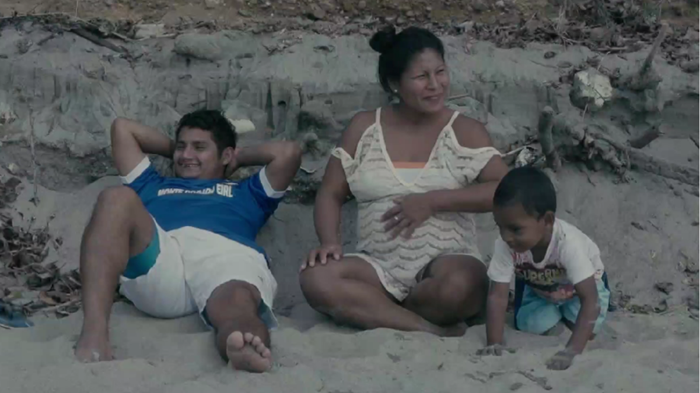

---

## ¿Por qué Jama?

  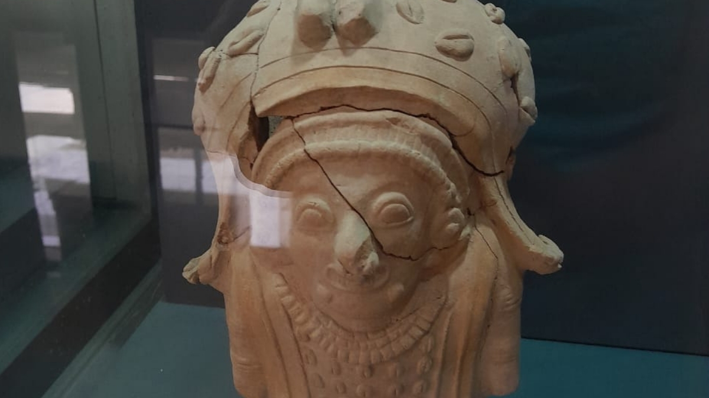

Nuestra propuesta se concentra en la zona de Jama, Manabí, punto estratégico de la llamada "Mancomunidad del Pacífico Norte", [MANPANOR](https://manpanor.gob.ec), cuyo actual presidente, Néxsar Cevallos Medina, es también el actual alcalde del cantón Jama. Hemos detectado que en la zona existen varias iniciativas ciudadanas, entre las cuales se destacan Jóvenes de MANPANOR y Sembradores de Paz, así como la Fundación A Mano Manaba y la iniciativa Futuros Urbanos, de Fundación Hivos, en sociedad con Fundación Fuegos. Estas iniciativas cubren aspectos como el fomento de la lectura y el desarrollo cultural, además de la soberanía alimentaria y la alimentación inclusiva. 

Según [Fundación Hivos](https://america-latina.hivos.org/program/futuros-urbanos/ciudades/manpanor/), "MANPANOR (Mancomunidad Pacífico Norte de Manabí) está conformada por cuatro municipios con una población total de unos 200.000 habitantes, de los cuales el 60 % son menores de 30 años. La Mancomunidad se creó para reforzar la gobernanza y la participación ciudadana en cuestiones de desarrollo. Sus municipios se enfrentan a los mismos retos, entre ellos la migración juvenil..."

Durante diciembre y enero realizamos una inmersión técnica en Jama para entender por qué los programas sociales suelen tener un impacto efímero. Identificamos que el mayor obstáculo es la **erosión de la identidad**.

* **El olvido de la cultura Jama Coaque:** Los niños crecen donde su patrimonio es invisible. Marina Mendoza (Bibliotecaria) resalta: *"Antes teníamos convenio con la Fundación Care... pero con el terremoto todo se perdió... hoy son contadas las bibliotecas que existen"*.
* 
* **Pérdida del amor propio:** Al no recibir apoyo para fortalecer su idiosincrasia, los jóvenes desarrollan una "desconexión identitaria". Esto explica por qué el horizonte de metas es tan limitado: el niño no se siente parte de una historia de grandeza, sino de una estadística de escasez.

* **Urgencia institucional:** El Municipio reconoce la voluntad de cambio, pero la orfandad presupuestaria impide programas de largo aliento. La FRM puede validar esta identidad a través del deporte.

### Reflexión final
Nuestra propuesta es un **rescate de identidad**. Usaremos el fútbol para que el niño de Jama vuelva a sentirse tan poderoso como sus ancestros. Hasta 2017, Jama destacaba como un oasis de tranquilidad; en 2016 cerró con una tasa de **cero homicidios**, espíritu que se mantiene y ofrece un entorno seguro para la inversión social.

El pueblo de **Don Juan** posee un potencial excepcional. La Fundación [**“A mano manaba”**](https://www.amanomanaba.org/), ubicada en Loma Don Juan, por ejemplo, ha logrado premios internacionales, demostrando que la comunidad responde cuando se le brindan herramientas. La biodiversidad de la zona permite, además, observar monos aulladores y guacharacas, escenario inigualable para fomentar el respeto al medioambiente.

  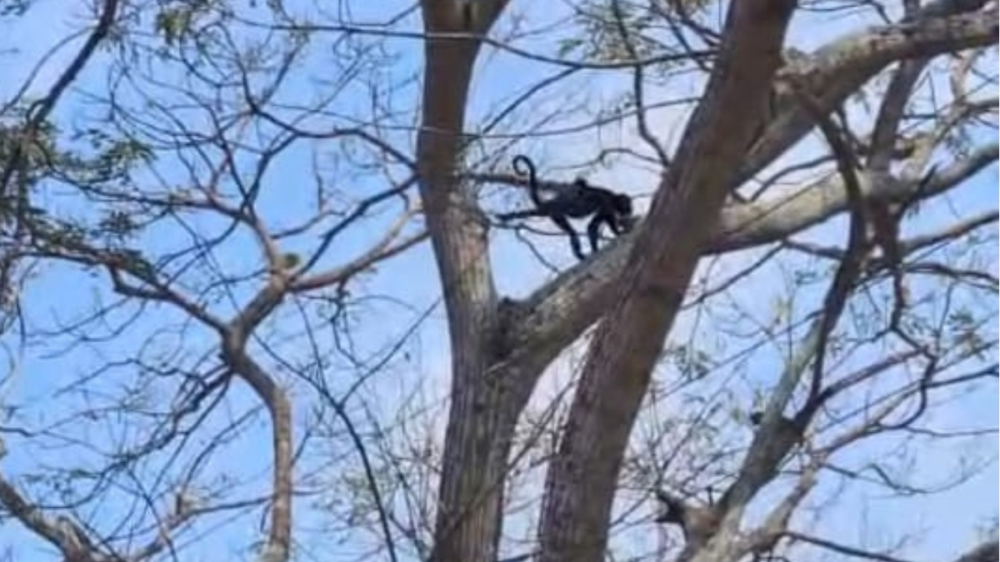
   
  <em>Monos aulladores, parte del entorno natural de Loma Don Juan, un contexto ideal para el aprendizaje lúdico.</em>

---

## Sobre Kod Kod

El kodkod (o güiña) es el felino más pequeño de toda América; un habitante de los bosques andinos que, a pesar de su tamaño, posee un espíritu ferozmente independiente y una capacidad de adaptación asombrosa. 
Inspirados en esa naturaleza, Kod Kod nace como una agencia creativa de estructura ágil y alta especialización, dedicada a generar ideas y estrategias innovadoras que transforman el propósito de una organización en un impacto social tangible. 

A través del diseño estratégico, la narrativa audiovisual y el storytelling, desarrollamos conceptos únicos y visualmente contundentes con la fuerza necesaria para movilizar comunidades y redefinir la realidad de su entorno.

**Kod Kod** *Set the world on fire.*

  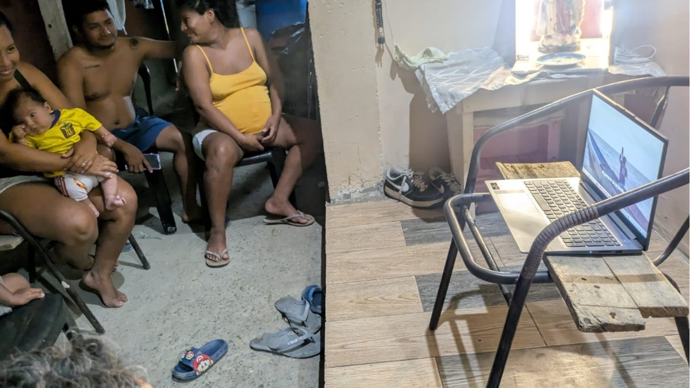
  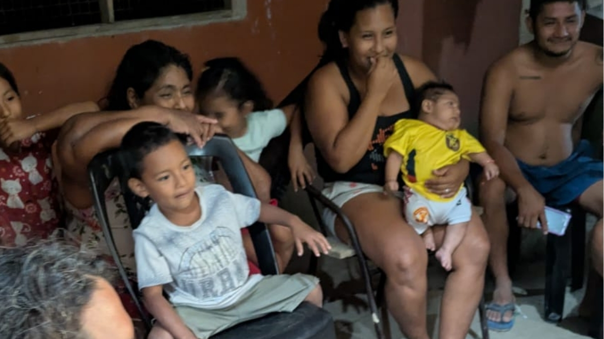
   
  <em>Equipo de Kod Kod presentando el video "Mucho más que fútbol" a sus protagonistas.</em>

