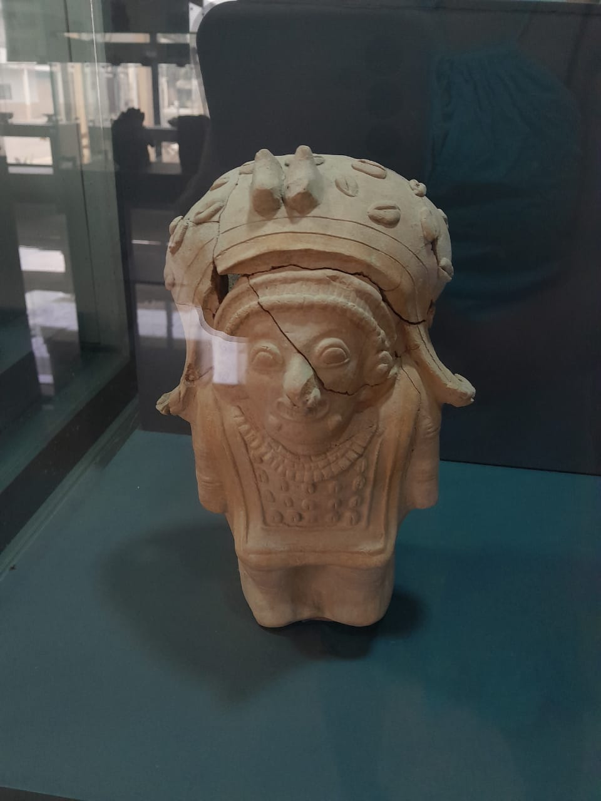
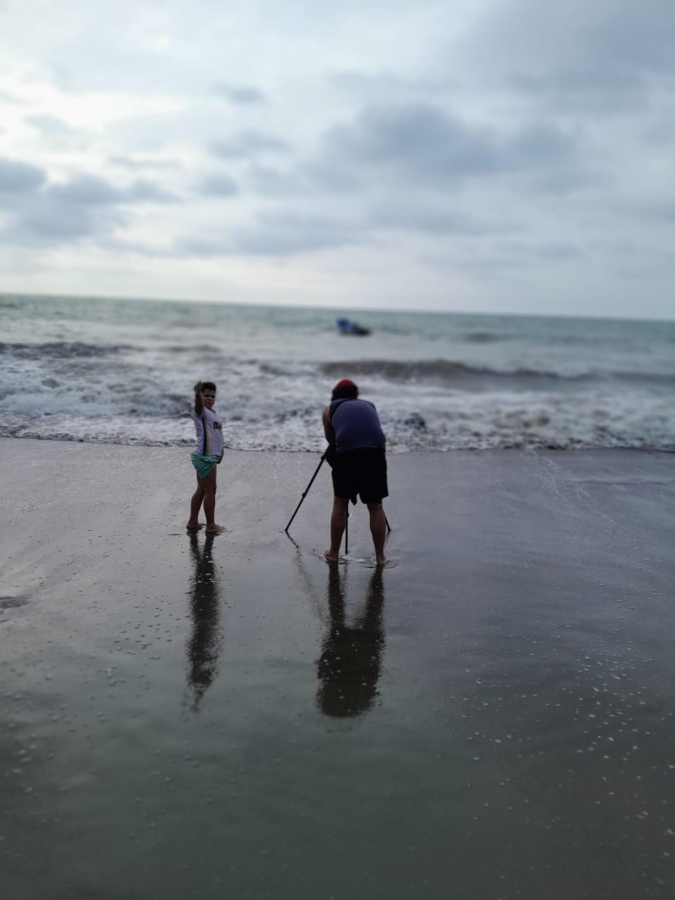
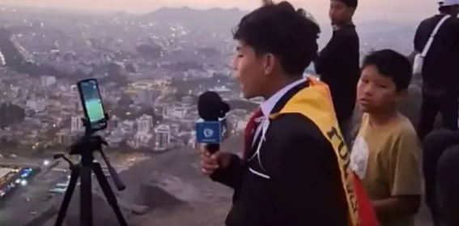
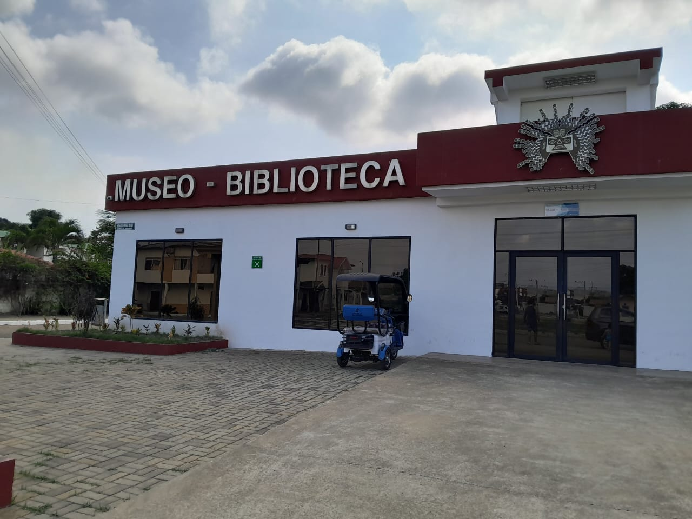
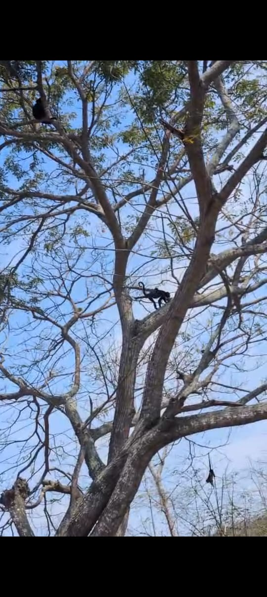

# frm-proposal
Ecuador: iniciativas futuras 
# Propuestas de iniciativas para la Fundación Real Madrid 

Nos complace presentar estas ideas que buscan desencadenar un proceso gradual de mejora social en la provincia de Manabí-Ecuador, así como en otras áreas del país que estén alineadas con los más de 150 proyectos de la Fundación Real Madrid (FRM) en Latinoamérica. 

***

## Visión general
Nuestro objetivo es fortalecer el trabajo de la FRM para ofrecer herramientas prácticas y concretas a los niños de Manabí y sus familias, las mismas que podrán usarse para empezar a construir un futuro estable y pleno, con esfuerzo, paciencia y perseverancia.

Estas iniciativas están diseñadas para fortalecer autoestima, autonomía, acceso responsable a tecnología, acceso a educación en valores, acceso a salud y acceso a alimentación.

***

## Propuesta 1. Mentoría tecnológica 

### El desafío: falta de motivación
Los niños de Manabí, en su gran mayoría, tienen intereses y aficiones, mas no metas. Sin metas, la vida se vuelve un transcurrir sin sentido. 

Durante la realización del video “Mucho más que fútbol”, nos adentramos en la realidad de un grupo de niños y familias de la zona de Jama (por logística, una zona más accesible que la de Montecristi, en donde funciona la escuela CAF Núñez). Kod Kod tiene una base en ese sector, concretamente en Loma Don Juan, a donde nuestro equipo viaja frecuentemente por descanso, producciones y retiros creativos.

Para nuestro equipo resultó desolador ver de primera mano el futuro con el que sueñan estos niños y niñas: crecer para pasar hambre; criar hijos sin apoyo (en el caso de las niñas) y tratar de olvidar el poco sentido que tiene su vida a través del alcohol (en el caso de los niños), siempre presente durante los fines de semana. Ese es el panorama que para ellos pintan sus padres, desde la inconsciencia y la repetición casi inevitable de patrones tóxicos. 

Pero no solo eso. A la mayoría de los niños de Manabí se les ha arrebatado el derecho a ser niños sin preocuparse de los problemas de los adultos que supuestamente deben cuidarlos. Los niños de Manabí, muchos de ellos, tal como le pasa a un adulto, necesitan tomar café varias veces al día para "soportar el ritmo" de la vida.Erick, uno de los niños, no mayor de diez años de edad, relató con total naturalidad cómo tuvo que ser el partero improvisado de su tía en dos ocasiones. A su tierna edad, literalmente, trajo al mundo a dos de sus primos. 

### La propuesta 
Desde Kod Kod, implementaremos un programa piloto de mentoría tecnológica para formar a los estudiantes como creadores de contenido, en alianza con escuelas de cine y producción audiovisual, periodistas deportivos, creadores de contenido y realizadores ecuatorianos, dirigido a 15 niños (para empezar), de entre 7 y 12 años de edad. 

La formación estará orientada hacia el periodismo deportivo, pero el conocimiento recibido se podrá aplicar a todo tipo de temática narrativa. Nos concentraremos en el formato vertical, más accesible en términos de complejidad, producción y fácil de asimilar para los más pequeños, aunque también los versaremos en conocimientos básicos de teoría del cine, de manera didáctica y simple. 

### Impacto estimado 
**Expectativa:** el objetivo es que al menos un 80 % de los participantes logren terminar el programa y recibir una certificación. La formación incluye la cobertura de los partidos y torneos del CAF.

**Alcance:** Guayas, Pichincha y Manabí son provincias con una alta concentración de población infantil. Las piezas audiovisuales que los niños y niñas produzcan en Manabí durante su formación serán difundidas en redes sociales y dirigidas a audiencias infantiles con objetivos educacionales. Aspiramos a llegar a un público de alrededor de 150 000 niños en redes sociales. Como referencia, Pol Deportes ha amasado una audiencia de casi 800 000 seguidores en Instagram y casi 2 millones en TikTok. Su hazaña viral (narrar una final de la Copa Libertadores desde un cerro), le valió una invitación para narrar, precisamente, un partido del Real Madrid. 

***

## Propuesta 2. Documental vertical “Crónicas de esperanza”

### El desafío: falta de visibilidad
Falta de visibilidad de la gestión de la Fundación Real Madrid en Manabí para atraer a más instituciones locales y extranjeras a apostar por una región que se encuentra en un momento crucial. La provincia y su gente están frente a una elección fundamental entre la “luz” (educación, autoestima, progreso) y la “oscuridad” (pobreza mental y material, crimen organizado).

### La propuesta 
Serie documental que acompaña a los niños de Manabí beneficiados por la FRM durante una época para conocer su vida y ver cómo el fútbol y los valores que de él se desprenden van impactando en su día a día. El mismo formato puede aplicarse a los logros obtenidos en la Escuela Sociodeportiva, en convenio con la UISEK. 

**Expectativa:** generar un sentido de pertenencia y orgullo local al mostrar historias reales de superación. Buscamos documentar la transición del niño que carece de horizontes hacia un joven con disciplina y valores claros. Como señala Yoselin Vélez, del Museo Jama Coaque, muchas veces el habitante local vive con su riqueza cultural pero *"no le toma mucha importancia"* por la fuerza de la cotidianidad. Este documental busca que el niño se vea a sí mismo como protagonista de su historia y heredero de una cultura milenaria.

**Alcance:** la serie apunta a audiencias globales interesadas en la responsabilidad social, utilizando redes sociales y plataformas de streaming. Buscamos atraer la mirada de instituciones internacionales al mostrar que en Manabí, a pesar de las limitaciones materiales, existe un potencial humano inmenso que requiere una plataforma de visibilidad.

***

## Propuesta 3. La CAF Núñez llega a Jama

### El desafío: expansión territorial
Necesidad de expansión de la escuela CAF Núñez a más zonas de la provincia de Manabí. 

### La propuesta 
Replicar el modelo de la escuela CAF Núñez en la provincia de Jama, concretamente en la zona de Don Juan, que se encuentra a pocos minutos del centro de la ciudad. Es un entorno silencioso y cercano a la naturaleza que permite la conexión con la práctica deportiva. Asimismo, la creación de esta escuela serviría como un motor económico y cultural en una zona azotada por el abandono estatal. 

**Expectativa:** formalizar y potenciar iniciativas ciudadanas que hoy operan con recursos limitados. Emma Vera, del Municipio de Jama, menciona que existen grupos como los **"Sembradores de paz"**, donde jóvenes que desde el terremoto enseñan a los más pequeños valores a través del juego, pero que *"no tienen para comprar la hoja, para comprar lápiz de colores"* o reponer materiales básicos dañados. La expectativa es profesionalizar estos esfuerzos dotándolos de la metodología y recursos de la FRM.

**Alcance:** impactar directamente en las 42 comunidades del cantón Jama. Al establecer una base en Don Juan, se crea un polo de desarrollo donde el deporte se une a la educación lúdica, permitiendo que niños desde los 2 años empiecen a formarse en un ambiente sano y seguro.

***

## Propuesta 4. Paz, techo y comida 

### El desafío: vulnerabilidad sistémica
La vulnerabilidad extrema en la economía familiar y la salud nutricional, donde el ingreso familiar a menudo se diluye en el consumo de alcohol, descuidando las necesidades básicas de los menores.

### La propuesta 
Empezar a desarrollar una iniciativa de largo plazo en la que se amplíe el grado de influencia de la fundación gracias a la colaboración de aliados de alto impacto como Corporación La Favorita, Corporación El Rosado, Universidad San Francisco de Quito (USFQ) y Grupo Futuro. El objetivo es facilitar el acceso a salud, educación y alimentación en lugar de simplemente abrir plazas de empleo.

**Expectativa:** implementar un sistema de apoyo integral que ataque la desnutrición desde la raíz. Emma Vera propone un modelo donde se entreguen *"funditas de comida toda la semana"* a familias vulnerables y se realicen charlas de salud con médicos municipales para replicar en cada comunidad cómo alimentarse mejor y proveer vitaminas esenciales, asegurando que el recurso llegue directamente al bienestar del niño.

**Alcance:** lograr una transformación en los hábitos de supervivencia de las familias. Mediante la creación de "huertos orgánicos" y la entrega de semillas de hortalizas (pimiento, tomate, hierbita), buscamos que las madres puedan *"sembrar en su casa y tener para aliñar su comida"* de manera sana, fomentando una cultura de autosustentabilidad.

***

## ¿Por qué Jama?

Durante los meses de diciembre y enero realizamos una inmersión técnica en el cantón **Jama**, visitando el Municipio, la Biblioteca Municipal y el Museo de Jama. El objetivo fue entender por qué los programas sociales suelen tener un impacto efímero en la zona.

### El hallazgo: la invisibilidad del legado
A través de entrevistas con funcionarios municipales y gestores culturales, hemos identificado que el mayor obstáculo para el desarrollo infantil no es solo la falta de recursos, sino la **erosión de la identidad**.

* **El olvido de la Cultura Jama-Coaque:** a pesar de ser herederos de una de las culturas más sofisticadas del Ecuador antiguo, los niños crecen en un entorno donde su patrimonio es invisible. Marina Mendoza, bibliotecaria de Jama, resalta la orfandad de estos espacios: *"Antes teníamos convenio con la Fundación Care... pero con el terremoto todo se... desapareció el sistema nacional de bibliotecas... hoy son contadas las bibliotecas que existen en el país. "*.
* **Pérdida del amor propio:** al no recibir apoyo para fortalecer su idiosincrasia, los jóvenes desarrollan una "desconexión identitaria". Esto explica por qué el horizonte de metas es tan limitado: el niño no se siente parte de una historia de grandeza, sino de una estadística de escasez.
* **Urgencia institucional:** el Municipio reconoce la voluntad de cambio, pero la orfandad presupuestaria para temas culturales impide crear programas de largo aliento. La Fundación Real Madrid puede ser el aliado que valide esta identidad a través del deporte.
* 

**Reflexión final:** nuestra propuesta no es solo deportiva; es una intervención de **rescate de identidad**. Usaremos el fútbol para que el niño de Jama vuelva a sentirse tan poderoso y creativo como sus ancestros, dándole un propósito que lo aleje de los ciclos de riesgo social.

Jama es un cantón y una ciudad caracterizada por ser una zona de paz. Hasta el año 2017, Jama destacaba como un oasis de tranquilidad con tasas de criminalidad prácticamente nulas. En 2016 el cantón cerró con una tasa de **cero homicidios**, una convivencia pacífica que se mantiene en el espíritu de su gente y que ofrece un entorno seguro para la inversión social.

El pueblo de **Don Juan**, en particular, posee un potencial excepcional para el desarrollo de iniciativas ciudadanas. Un ejemplo notable de éxito es el Centro Cultural de la Fundación **“A mano manaba”**, una iniciativa que ha logrado reconocimiento y premios internacionales, demostrando que la comunidad responde con compromiso cuando se le brindan herramientas culturales y educativas.

El entorno natural de Don Juan ofrece una naturaleza pura y exuberante donde es posible observar monos aulladores, iguanas, guacharacas y guatuzas en su estado silvestre. Este contacto directo con la biodiversidad ofrece un escenario inigualable para fomentar valores de respeto al medio ambiente y curiosidad científica desde temprana edad.

***

## Sobre Kod Kod 

Kod Kod nace de la necesidad de crear una agencia creativa de pequeña escala en términos logísticos, pero de amplia expansibilidad en cuanto a su alcance y al rango de impacto que aspira llegar a tener. 

Kod Kod busca ofrecer un servicio que se distinga por un nivel alto de personalización y la creación de piezas cuya base sean el arte y la autenticidad creativa, apostando por la creación de piezas contundentes. 

![Equipo de Kod Kod en campo: proceso de levantamiento de información y presentación íntima del video “Mucho más que fútbol”]](Presentación Video .jpeg)

![Reacciones de los participantes durante la presentación íntima del video “Mucho más que fútbol”]](Presentación Video .jpeg) Presentación Video 2.jpeg

En Kod Kod creemos en el valor de la creatividad humana, sin caer en una visión naif que desconozca por completo los avances tecnológicos actuales. Se trata de alcanzar un equilibrio que posibilite una transformación estética y social verdadera.

**Kod Kod**
*Set the world on fire.*
